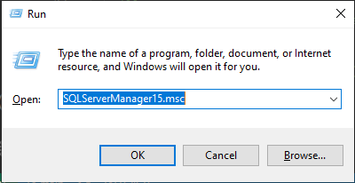
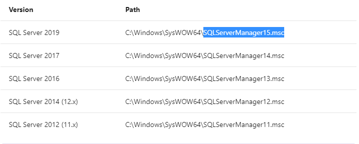
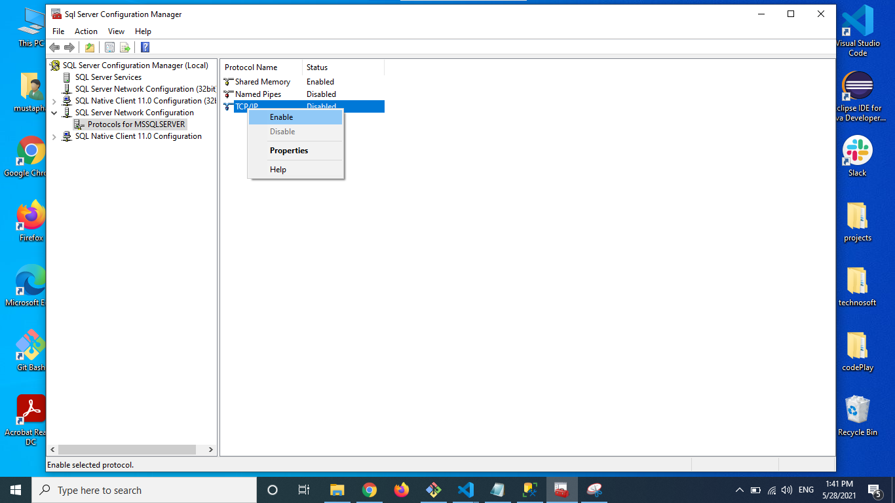
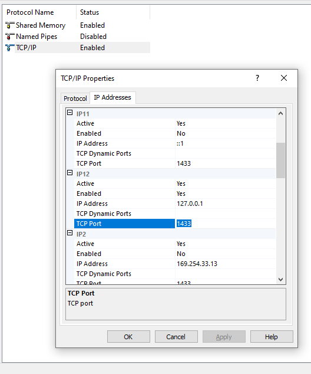

# Instalation guide

## download nodejs
- download corresponding version according to your platform from : https://nodejs.org/download/release/v14.15.2/
- install it 

## install git
- download from: ```https://git-scm.com/downloads```

## install android studio 
- download from: ```https://developer.android.com/studio#downloads```
- install android SDK 30.0

## install SQL server 2019 developer edition
- download from ``` https://go.microsoft.com/fwlink/?linkid=866662 ```

## install ionic 
```
npm install -g @ionic/cli
```


## clone repository
```
git clone https://github.com/ChaTbiM/snipObserve.git
```
or download it from ```https://github.com/ChaTbiM/snipObserve/archive/refs/heads/main.zip```
and extract it into folder


## install client dependencies
- change directory to client folder
- execute following command
```
npm install
```

## install server dependencies
- change directory to client folder
- execute following command
```
npm install
```

## enable TCP/IP , localhost , 1433 port
- first step 


Note : this command ``` SQLServerManager15.msc ``` changes according to the version of SQL server you have 



-second step 


-third step


## preparing database 
- change directory to server folder
- run ``` npx sequelize db:migrate ```
- run ``` npx seqelize db:seed:all ```

## run server 
- make sure you are on server folder
- run command ``` npm run watch ```

### run client
- activate wifi on your local machine
- activate hotspot ( share wifi )
- connect your device with the local machine using usb
- change directory to client folder 
- run command ``` ionic capacitor run android -l --external --public-host=192.168.1.7 ```
- android studio will open , make sure to run the app on the connect device through usb

## testing credentials 
- email : ``` chatbimdev@gmail.com ```
- password : ``` password ```


